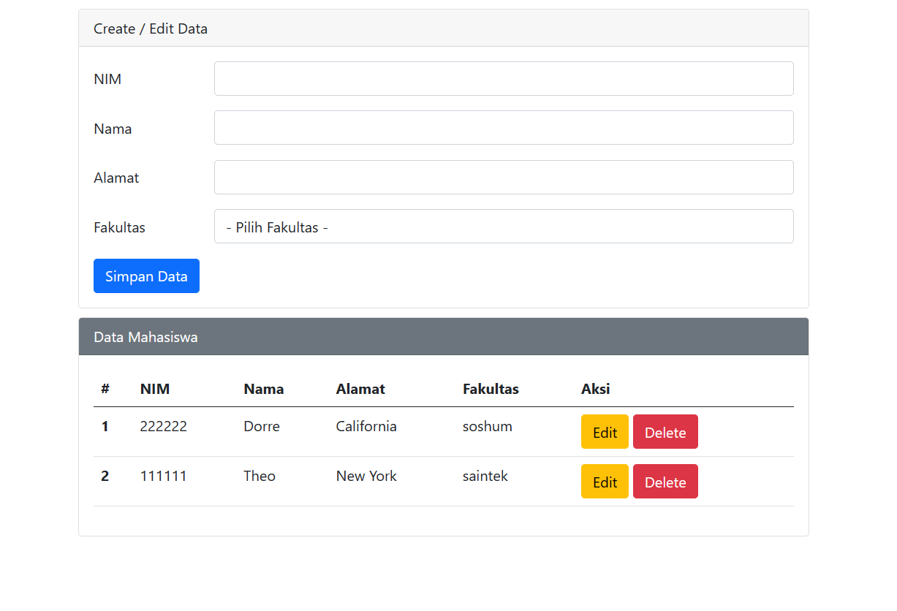

# Student Data CRUD Application using PHP and MySQL

This is a basic CRUD (Create, Read, Update, Delete) application implemented in PHP and MySQL for managing student data.

## Features

- Add new students to the database.
- View a list of all students.
- Update information of existing students.
- Delete students from the database.

## Prerequisites

- PHP (7.0 or higher)
- MySQL (5.6 or higher) and a database
- Web server (e.g., Apache, Nginx) for running the PHP application

## Installation

1. Clone or download this repository to your web server's directory.
2. Create a MySQL database and import the `students.sql` file to set up the required table.
3. Update the database configuration in `config.php` with your MySQL database credentials.

## Usage

1. Access the application through your web browser.
2. You'll see a list of students with options to edit and delete each entry.
3. Use the "Add Student" button to create new student records.
4. Click on a student's name to view more details or update their information.
5. Use the "Delete" button to remove a student from the database.

## Structure

- `index.php`: Displays the list of students and provides navigation.
- `students.sql`: SQL file to create the `students` table.

## Security Considerations

- This example focuses on functionality and doesn't cover advanced security measures.
- Input validation and sanitation are crucial to prevent SQL injection and other vulnerabilities.
- Consider using prepared statements or an ORM for more secure data handling.

## Contributing

Feel free to contribute by submitting pull requests with enhancements or fixes!

## License

This project is licensed under the [MIT License](LICENSE).

